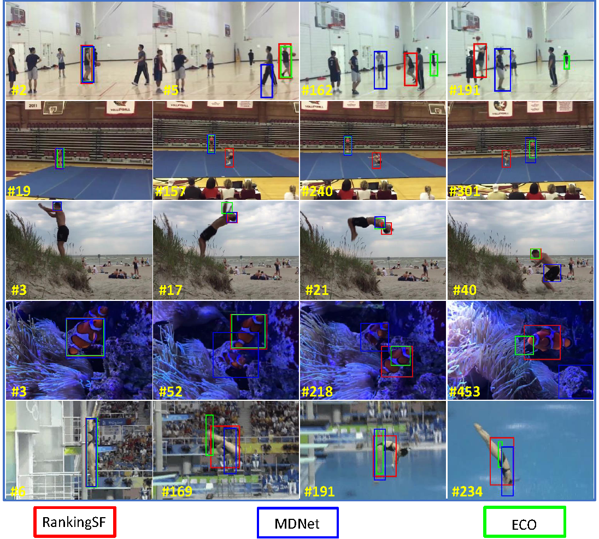

# RankingT: Visual object tracking by using Ranking Loss
# Visual Object Tracking by Using Ranking Loss and Spatial-Temporal Features (RankingAF and RankingSF)
You can find our [Ranking paper](http://openaccess.thecvf.com/content_ICCVW_2019/papers/VOT/Cevikalp_Visual_Object_Tracking_by_Using_Ranking_Loss_ICCVW_2019_paper.pdf).

### Trackers
Official implementation of RankingT, RankingAF and RankingSF.
These methods introduces a novel two-stream deep neural network tracker for robust object tracking. In the proposed network, we use both spatial and temporal features and employ a novel loss function called ranking loss. The class confidence scores coming from the two-stream (spatial and temporal) networks are fused at the end for final decision. Using ranking loss in the proposed tracker enforces the networks to learn giving higher scores to the candidate regions that frame the target object better. As a result, the tracker returns more precise bounding boxes framing the target object, and the risk of tracking error accumulation and drifts are largely mitigated when the proposed network architecture is used with a simple yet effective model update rule.
#### The proposed two stream tracker
The architecture of the proposed two-stream network: We learn class-specific weights to fuse classifiers’ outputs of the two networks.


#### The proposed Ranking loss


## Results
#### The values of the online learned fusion weights for spatial and temporal networks for the zebrafish


video frames
We compared the proposed trackers, RankingAF and RankingSF (remember that RankingAF simply adds the scores of two networks directly whereas RankingSF learns network
specific weights as described earlier), on 6 different benchmark datasets.

#### Visual Comparison 
Visual comparison of the our proposed method RankingSF with MDNet and ECO. The red, blue and green rectangles represent RankingSF, MDNet and ECO trackers, respectively.

## Citation
If you're using this code in a publication, please cite our paper.

```
@InProceedings{Cevikalp_2019_ICCV_Workshops,  
author = {Cevikalp, Hakan and Saribas, Hasan and Benligiray, Burak and Kahvecioglu, Sinem},  
title = {Visual Object Tracking by Using Ranking Loss},  
booktitle = {The IEEE International Conference on Computer Vision (ICCV) Workshops},  
month = {Oct},  
year = {2019}  
}
```
